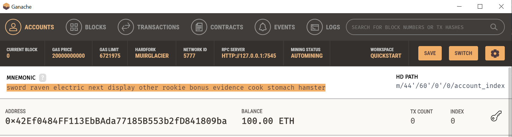
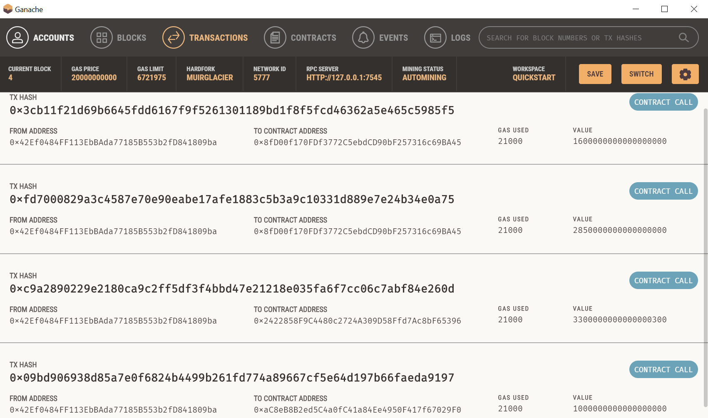
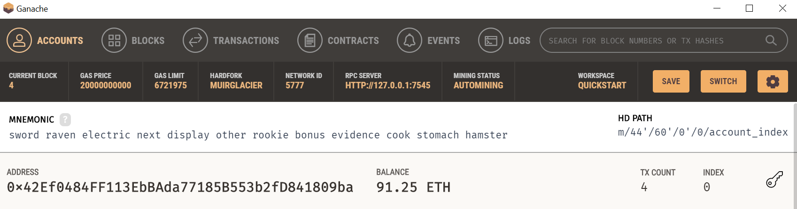
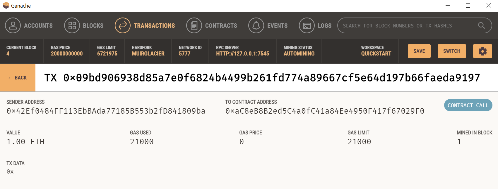
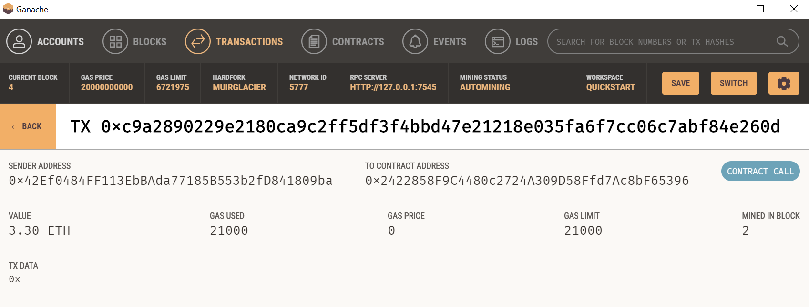
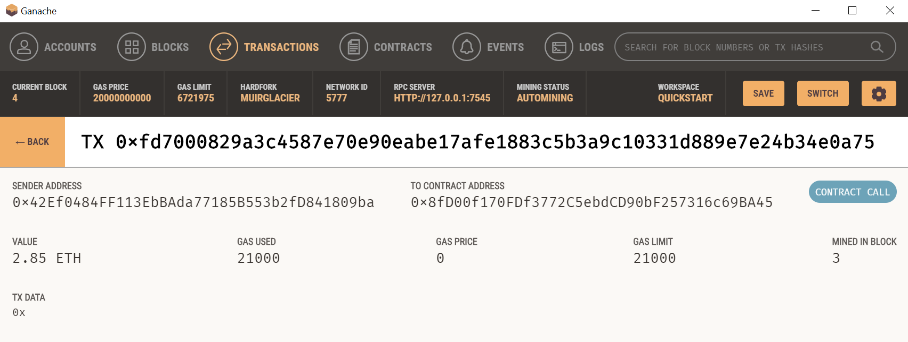
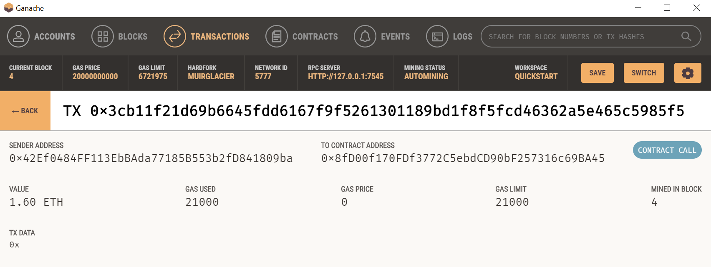

# Unit 19 Homework: Cryptocurrency Wallet

This is my homework submission for week 19 of the fintech bootcamp. In this exercise, we create a streamlit application, linking with Ganache, to simulate transfering ethereum to a contractor who is hired.

## Starting Balance of Ganache Account

## Transactions Performed

## Ending Balance of Ganache Account

## Recipient 1 Lane's Account

## Recipient 2 Ash's Account

## Recipient 3 Jo's Account

## Recipient 4 Kendall's Account

